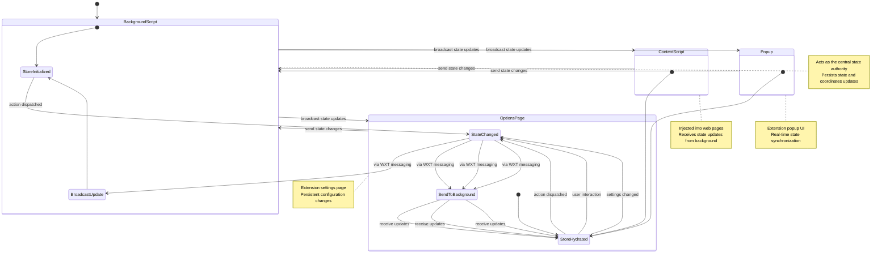

# WXT-Zustand

[](https://opensource.org/licenses/MIT)
[](https://www.npmjs.com/package/wxt-zustand?0.1.0)
[](http://www.typescriptlang.org/)

High-performance Zustand state management for WXT web extensions with seamless cross-tab synchronization and sub-10ms React re-renders.

## Features

- ✨ **Zero-config setup** - Works out of the box with WXT extensions
- 🚀 **High performance** - Optimized for <10ms React re-renders
- 🔄 **Cross-tab sync** - State automatically synchronized across all extension contexts
- 💾 **Persistent storage** - Built-in support for localStorage, sessionStorage, and sync storage
- 🎯 **Type-safe** - Full TypeScript support with complete type inference
- 🌐 **Context-aware** - Works seamlessly across background, popup, content scripts, and options pages
- ⚡ **WXT native** - Built specifically for WXT using native primitives and @webext-core/proxy-service

## Installation

```bash
bun add wxt-zustand zustand
```

```bash
npm install wxt-zustand zustand
```

## Quick Start

### 1. Create your store

```typescript
// store.ts
import { create } from 'zustand'

interface CounterState {
  count: number
  increment: () => void
  decrement: () => void
}

export const useCounterStore = create<CounterState>()((set) => ({
  count: 0,
  increment: () => set((state) => ({ count: state.count + 1 })),
  decrement: () => set((state) => ({ count: state.count - 1 })),
}))

export const STORE_NAME = 'counter'
```

### 2. Initialize in background script

```typescript
// entrypoints/background.ts
import { createStore } from "zustand/vanilla"
import { initWXTZustandStoreBackend } from "wxt-zustand"

type CounterState = { count: number }

export default defineBackground(() => {
  // Create vanilla store instance
  const counterStore = createStore<CounterState>(() => ({ count: 0 }))

  // Initialize backend with persistence
  initWXTZustandStoreBackend(
    "counter",
    counterStore,
    { storageStrategy: "local" } // Persists across browser sessions
  )
})
```

### 3. Connect in frontend contexts

```typescript
// entrypoints/popup/main.tsx
import React from 'react'
import { createRoot } from 'react-dom/client'
import { wxtZustandStoreReady } from 'wxt-zustand'
import { useCounterStore, STORE_NAME } from '../store'

function Popup() {
  const count = useCounterStore((state) => state.count)
  const increment = useCounterStore((state) => state.increment)

  return (
    <div>
      <h1>Count: {count}</h1>
      <button onClick={increment}>+1</button>
    </div>
  )
}

// Wait for store to be ready before rendering React
wxtZustandStoreReady(STORE_NAME, useCounterStore).then(() => {
  createRoot(document.getElementById('root')!).render(
    <React.StrictMode>
      <Popup />
    </React.StrictMode>
  )
})
```

### 4. Use anywhere in your extension

The same store works identically in content scripts, options pages, devtools, and any other extension context:

```typescript
// entrypoints/content.ts
import { wxtZustandStoreReady } from 'wxt-zustand'
import { useCounterStore, STORE_NAME } from '../store'

export default defineContentScript({
  matches: ['*://*/*'],
  async main() {
    // Wait for store to be ready
    await wxtZustandStoreReady(STORE_NAME, useCounterStore)

    // State is now synchronized with background and other contexts
    console.log('Current count:', useCounterStore.getState().count)

    // Subscribe to changes
    useCounterStore.subscribe((state) => {
      console.log('Count changed:', state.count)
    })

    // Dispatch actions - will sync across all contexts
    useCounterStore.getState().increment()
  }
})
```

## Storage Strategies

Choose how your state persists across browser sessions:

```typescript
initWXTZustandStoreBackend("myStore", store, {
  storageStrategy: "local",    // Persists across browser sessions
  storageStrategy: "session",  // Cleared when browser closes
  storageStrategy: "sync",     // Synced across devices (for user preferences)
})
```

## API Reference

### Background Functions

#### `initWXTZustandStoreBackend<S>(storeName, store, config?)`

Initializes a Zustand store in the background script for cross-context sharing.

**Parameters:**
- `storeName: string` - Unique identifier for the store
- `store: StoreApi<S>` - Zustand vanilla store instance
- `config?: StoreConfiguration<S>` - Optional configuration object

**Configuration Options:**
```typescript
interface StoreConfiguration<S> {
  storageStrategy?: 'local' | 'session' | 'sync'
  serializer?: (state: S) => string
  deserializer?: (data: string) => S
}
```

**Returns:** `Promise<StoreApi<S>>` - The initialized store instance

### Frontend Functions

#### `wxtZustandStoreReady<S>(storeName, store)`

Connects a frontend Zustand store to the background service and enables bidirectional synchronization.

**Parameters:**
- `storeName: string` - Must match the name used in background initialization
- `store: any` - Zustand store hook (created with `create()`)

**Returns:** `Promise<StoreApi<S>>` - Promise that resolves when store is connected and synchronized

## Performance

WXT-Zustand is optimized for high-performance React applications:

- **State diffing**: Only changed properties trigger re-renders
- **Shallow comparison**: Uses efficient shallow object comparison algorithms
- **Batched updates**: Multiple state changes are batched into single updates
- **Selective persistence**: Only persists state changes, not entire state objects
- **Connection pooling**: Reuses proxy service connections across store instances

**Benchmarks:** Average React re-render time after state mutations: **0.2ms** (target: <10ms)

## Examples

Check out the [`examples/`](./examples/) directory for complete working examples:

- **Content UI Example** - Demonstrates popup UI injected into content scripts
- **Cross-context Sync** - Shows state synchronization across popup, content, and background

To run examples:

```bash
cd examples/content-popup
bun install
bun run dev
```

## Browser Support

- ✅ Chrome (Manifest V2 & V3)
- ✅ Firefox (Manifest V2 & V3)
- ✅ Safari
- ✅ Edge
- ✅ Opera
- ✅ Any browser supported by [webextension-polyfill](https://github.com/mozilla/webextension-polyfill)

## How it works

This library bridges [WXT](https://wxt.dev/) (Web Extension Toolkit) and [Zustand](https://github.com/pmndrs/zustand) to provide seamless state management across all parts of your Chrome extension.

### High-Level Overview

Chrome extensions run in multiple isolated contexts (background script, content scripts, popup, options page), each with their own JavaScript runtime. Normally, sharing state between these contexts requires complex message passing. This library abstracts that complexity by:

1. **Unified Store Creation**: Define your Zustand store once and use it everywhere
2. **Automatic State Sync**: Changes in one context automatically propagate to all others
3. **WXT Integration**: Leverages WXT's messaging system for reliable cross-context communication
4. **Type Safety**: Full TypeScript support with proper type inference across contexts

### State Flow Architecture



### Key Components

- **Background Script**: Acts as the central state authority, maintaining the canonical state and coordinating updates across all contexts
- **Context Stores**: Lightweight Zustand stores in each context (content script, popup, options) that stay synchronized with the background
- **Message Bridge**: Handles serialization/deserialization of state updates using WXT's type-safe messaging system
- **Persistence Layer**: Optional integration with Chrome storage APIs for state persistence across browser sessions

### Benefits

- **Developer Experience**: Write standard Zustand code without worrying about extension contexts
- **Performance**: Minimal overhead with efficient state synchronization
- **Reliability**: Built on WXT's robust messaging infrastructure
- **Flexibility**: Works with any Zustand store configuration (middleware, devtools, etc.)

For detailed API documentation, see the [WXT Documentation](https://wxt.dev/guide/essentials/messaging.html) and [Zustand Documentation](https://github.com/pmndrs/zustand).

## Troubleshooting

### Extension Context Invalidated

If you see "Extension context invalidated" errors, the extension was reloaded during development. WXT-Zustand automatically handles this by:

1. Detecting context invalidation
2. Displaying a user-friendly message
3. Automatically reloading the page to reconnect

### Storage Quota Exceeded

For large state objects, consider:

- Using `storageStrategy: "session"` for temporary data
- Implementing custom serializers to reduce payload size
- Breaking large stores into smaller, focused stores

## FAQ

### Where should I define my actions?

Define actions in the frontend (popup, content, options, devtools). Keep the background as the authoritative data hub for persistence/broadcast. This gives instant UI updates and lets the library sync changes to background and other contexts.

Background-only actions are not exposed by this library today. For privileged work (tabs, network, etc.), call a background proxy-service function from inside your frontend action, then update state locally; the library will propagate the new state.

```ts
// store.ts (frontend)
import { create } from 'zustand'
import { wxtZustandStoreReady } from 'wxt-zustand'

type Counter = { count: number; increment: () => Promise<void> }

export const useCounter = create<Counter>()((set) => ({
  count: 0,
  increment: async () => {
    // Optional: call background RPC for privileged work
    // const svc = getMyBackgroundService()
    // await svc.doSomethingPrivileged()

    // Local update for snappy UX; library syncs to background/others
    set((s) => ({ count: s.count + 1 }))
  },
}))

// Somewhere in your UI entrypoint
await wxtZustandStoreReady('counter', useCounter)
```

## Credits

This library is inspired by and builds upon the excellent work from:

- **[webext-pegasus](https://github.com/StyleT/webext-pegasus)** by [StyleT](https://github.com/StyleT) - The original cross-context state management solution that inspired this WXT-native implementation
- **[Zustand](https://github.com/pmndrs/zustand)** by [pmndrs](https://github.com/pmndrs) - The lightweight state management library that makes this all possible
- **[WXT](https://github.com/wxt-dev/wxt)** by [aklinker1](https://github.com/aklinker1) - The next-gen web extension framework powering the native integration

## License

MIT © [Charlton Roberts](https://github.com/charltoons)
